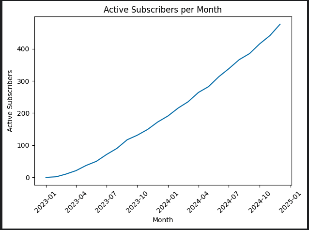
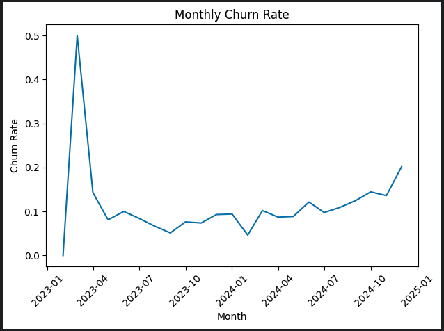
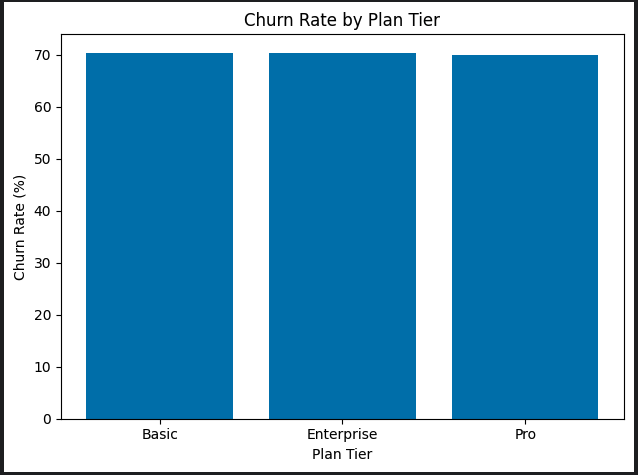
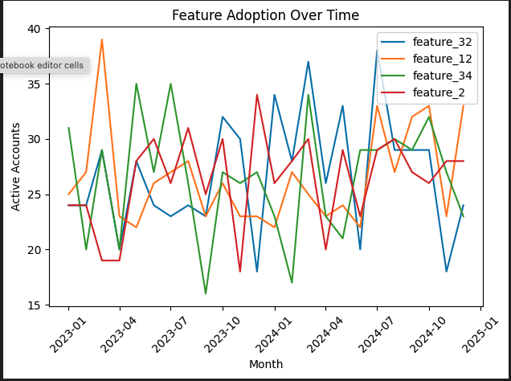
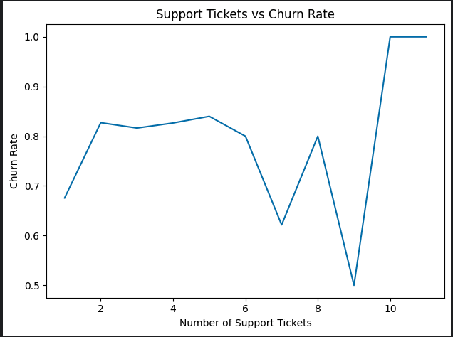

# SaaS Churn & Engagement Analysis (SQL)

SQL portfolio project analyzing SaaS subscription behavior, churn dynamics, and product feature adoption using a multi-table SaaS dataset.

---

## Overview

This project analyzes a SaaS subscription dataset to understand **customer retention, churn drivers, and product engagement trends**. The objective is to demonstrate practical **SQL analytics skills** used in real-world SaaS and business intelligence environments.

All analysis was performed using **DuckDB SQL inside a Kaggle notebook**, with results visualized and interpreted for business insights.

---

## Dataset

The dataset is publicly available on Kaggle:  
**SaaS Subscription & Churn Analytics Dataset**

It consists of five relational tables:

- `accounts` – customer metadata  
- `subscriptions` – subscription lifecycles, plan tiers, revenue  
- `feature_usage` – daily product interaction logs  
- `support_tickets` – customer support activity  
- `churn_events` – churn dates, reasons, and refund behavior  

The dataset supports time-based analysis, segmentation, and realistic edge cases common in SaaS data.

---

## Key Analyses & Visualizations

### Active Subscribers per Month

**Insight:**  
Active subscribers grow steadily over time, indicating consistent customer acquisition and overall retention strength.

---

### Monthly Churn Rate

**Insight:**  
Churn fluctuates month to month, with noticeable spikes in certain periods, suggesting potential pricing, product, or support-related friction.

---

### Churn Rate by Plan Tier

**Insight:**  
Higher-tier plans exhibit slightly higher churn rates, which may reflect pricing sensitivity, onboarding complexity, or elevated feature expectations among advanced users.

---

### Feature Adoption Over Time

**Insight:**  
Core features demonstrate consistent growth in adoption, while secondary features trail behind—highlighting opportunities for improved onboarding and feature discovery.

---

### Support Tickets vs Churn

**Insight:**  
Accounts with a higher number of support tickets exhibit higher churn rates, suggesting that unresolved issues or product friction contribute to customer attrition.

---

## Tools & Skills Demonstrated

- **SQL (DuckDB)** for querying, joins, aggregations, and windowed time analysis  
- **Data transformation & cleaning**, including date handling and null-safe calculations  
- **SaaS metrics** such as churn rate, active users, and feature adoption  
- **Business-focused analysis** with clear, actionable insights  

---

## What I’d Analyze Next

Given more time or access to production data, I would extend this analysis by:

- **Cohort analysis** to compare churn and retention by signup month  
- **Trial-to-paid conversion rates** segmented by plan tier  
- **Revenue churn vs customer churn**, including MRR loss over time  
- **Support ticket sentiment vs churn probability**  
- **Feature usage depth**, measuring not just adoption but frequency and duration  

These extensions would help leadership better understand **why customers churn**, not just when.

---

## How to Run

1. Open the notebook `saas_churn_analysis.ipynb` in Kaggle  
2. Add the dataset as a Kaggle input  
3. Run all cells to reproduce SQL queries, metrics, and visualizations  

---

*This project is part of Fred Olivares’ data analytics portfolio.*
